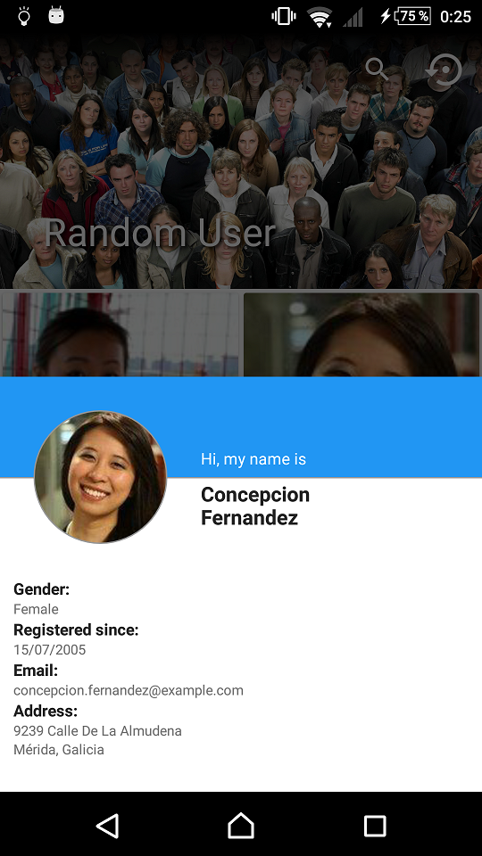
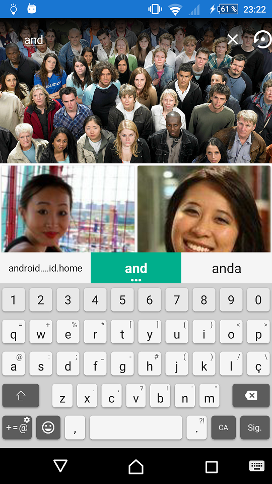
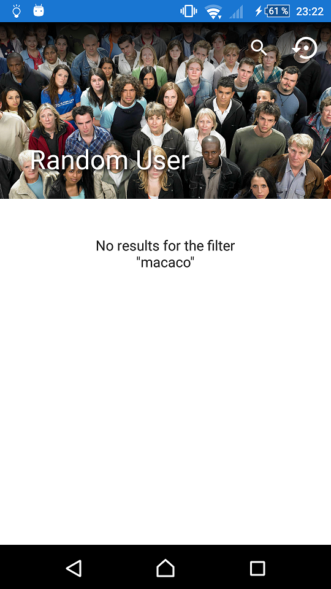
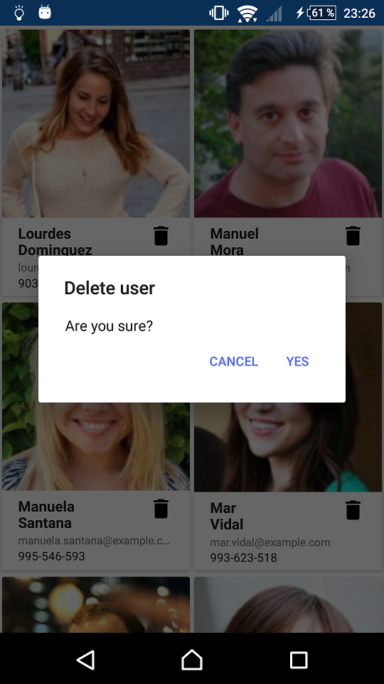
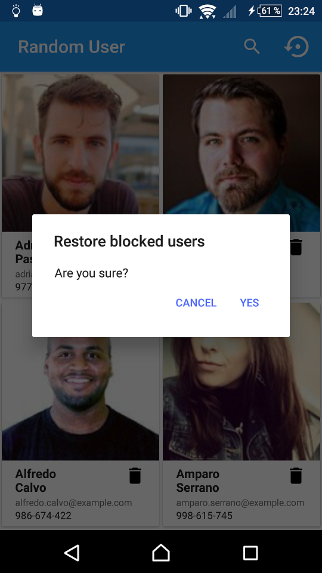
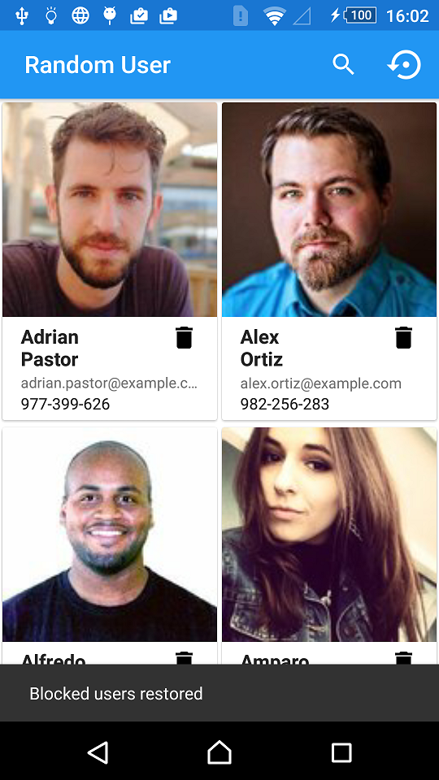

# Random User

Random User API use.

- The main Activity lists the Random Users using pagination.
- You can filter the actual list by name.
- Selecting a user will show a view with details for that user.
- After filtering results you can just go back or Swipe Refresh.
- The user information is persistent.
- Users can be deleted. When a user is deleted it gets blocked and won't be shown again until the list of blocked users is restored.
- A SwipeRefresh will restart the list from page 1, BUT, if we blocked a user, this won't show again until the list of blocked users is restored.

## Design

Simple design using a GridLayout with the users pictures and minimal description. On item click opens a BottomSheetDialogFragment with the full user details.

## Architecture

This application uses Clean Architecture with MVP.

## Info

Libraries:

- Picasso
- Butterknife
- RX
- Dagger 2
- Retrofit 2

Android Widgets:

- CoordinatorLayout
- AppBarLayout
- CollapsingToolbarLayout
- Toolbar
- SearchView
- SwipeRefreshLayout
- NestedScrollView
- RecyclerView
- ProgressBar

## Tests

Test for package, preferences, collections and dates.

## Screenshots

## License
    Copyright 2017 Esteban Latre
    
    Licensed under the Apache License, Version 2.0 (the "License");
    you may not use this file except in compliance with the License.
    You may obtain a copy of the License at
    
        http://www.apache.org/licenses/LICENSE-2.0
    
    Unless required by applicable law or agreed to in writing, software
    distributed under the License is distributed on an "AS IS" BASIS,
    WITHOUT WARRANTIES OR CONDITIONS OF ANY KIND, either express or implied.
    See the License for the specific language governing permissions and
    limitations under the License.
